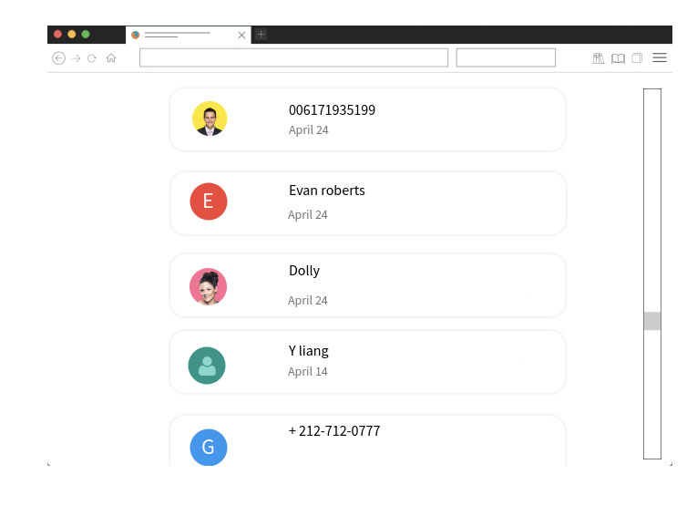

# Context :

At leboncoin, our users can share messages about a transaction, or ask for informations about any products.

Your job is to create the interface to consult those messages.
The interface needs to work on both desktop & mobile devices.

In addition to your code, a README explaining your thought process and your choices would be appreciated.

# Exercice :

- Display a list of all the conversations
- Allow the user to select a conversation
  - Inside the conversation, there is a list of all the messages between these two users.
  - As a user, you can type and send new messages in this conversation

**As your application can be used by millions of users, make sure to provide some robust safety guards.**

### Sketches :

Obvisouly, it is up to you to make something nice and pretty, you are free to design it the way you like. The sketches are here to give you an idea on how it should look.

  
Click to see the sketches

  
Mobile list :

Desktop list :

Mobile conversation :

Desktop conversation :

### API :

You can find the API swagger file in `docs/api-swagger.yaml`.

For a better readibility, you can view it on [https://leboncoin.tech/frontend-technical-test/](https://leboncoin.tech/frontend-technical-test/).

---

## 
create a .env.local file where you put 
API_URL=http://localhost:3005
NEXT_PUBLIC_API_URL=http://localhost:3005

